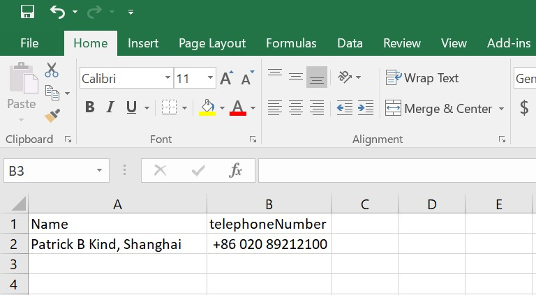

## update-ad.py

### Intro

Update-ad.py is a Python script to update different properties of AD user in batch. Properties can be many. See below detail description for how to define the properties to update.

### Install

- python3.5+

- virtualenv

  ```
  pip install virtualenv
  virtualenv ad-venv
  ad-venv\Scripts\activate
  ```

  That will install and activate a virtual environment

- openpyxl, pyad, pywin32

  ```
  pip install openpyxl pyad pywin32
  ```

  That will install the openpyxl and pyad modules

- update-ad.py

  ```
  git clone https://github.com/plj611/....
  ```

### Execute

```
python update-ad.py
```

### Detail description

update-ad.py reads the information from an Excel file and the file should place in the same directory as of update-ad.py

Below shows the layout of the Excel file



Column A is the canonical name of the user object. Canonical names can be obtained by using Active directory users and computers, goto the OU and select export. Copy the canonical names of the objects into a spreadsheet.

The properties to update should be placed after column A. Check below on how to find out the name of the properties of an user object.

```
Python 3.5.4 (v3.5.4:3f56838, Aug  8 2017, 02:17:05) [MSC v.1900 64 bit (AMD64)] on win32
Type "help", "copyright", "credits" or "license" for more information.
>>> from pyad import aduser
>>> u = 'Patrick B Kind, Shanghai'
>>> user = aduser.ADUser.from_cn(u)
>>> att = user.get_allowed_attributes()
>>> att.sort()
>>> for a in att:
...    print(a)
...
USNIntersite
aCSPolicyName
accountExpires
accountNameHistory
adminCount
adminDescription
adminDisplayName
allowedAttributes
allowedAttributesEffective
allowedChildClasses
allowedChildClassesEffective
altRecipient
altRecipientBL
altSecurityIdentities
assistant
attributeCertificate
attributeCertificateAttribute
audio
```

